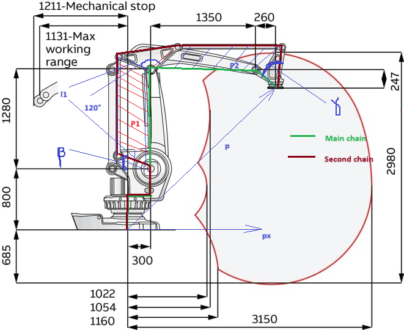
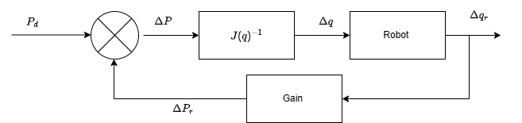

 

## Industrial Palletizing Robot Arm ABB  Project 

  
### Table of Contents
- [Introduction](#introduction)
- [Project Structure](#project-struture)
- [Methodology](#methodology)
- [Kinematic Problem](#kinematic-problem)
- [Inverse Kinamatic Problem](#inverse_kinematic_problem)
- [Control Schema](#control_schema)
- [Experimentation](#experimentation)
- [Referances](#referances)
- [Contributing](#contributing)
- [License](#license)  

### Introduction 
Welcome to my Industrial Palletizing Robot Arm project! Explore my journey of designing, building, and programming this complex robot and how I transformed it into a 2D drafting machine. Discover its kinematics, control systems, and more exciting features.

### Project Structure
The project is organized in the flowwing tree: 
<ul>
<li> Figures include simulation images and illustration graphics.
</li>
<li> Demo comprises demonstration videos and GIFs.  
</li>
<li> Datasheets consist of hardware component datasheets.
</li>
<li> Scripts encompass MATLAB calculus and command scripts. 
</li>
</ul> 
 

### Methodology
Regarding the complexity of the robot's kinematic chain, the equations I derived differ from the approach described in the following sections. I worked in cylindrical coordinates $(r, \rho, z)$ while keeping the base rotation of the robot fixed. I employed classical rigid body mechanics through closed-chain formulas.

### Kinematic Problem
 

  

 
The Denavit-Hartenberg Representation of our robot is described as follows:

$$A=
\begin{bmatrix}
c_{\theta_{i}} & -s_{\theta_{i}}c_{\alpha_{i}} &s_{\theta_{i}}s_{\alpha_{i}} & a_{i}c_{\theta_{i}} \\
s_{\theta_{i}}& c_{\theta_{i}}c_{\alpha_{i}}& -c_{\theta_{i}}s_{\alpha_{i}}& a_{i}s_{\theta_{i}} \\
0&s_{\alpha_{i}}& c_{\alpha_{i}}& d_{i}&\\
0 & 0 & 0 & 1\\
\end{bmatrix}
$$ 

The robot input parameters consist of three rotation angles denoted as $(q_1, q_2, q_3)$.

#### Main kinematic Chain
Link | $a_{i}$  |$\alpha_{i}$|$d_{i}$|$\theta_{i}$  
---|---         |---         |---    |---
1  | $a_{1}$    | 0          |$d_{1}$     | $q_{1}$
2  | $a_{2}$    | $90°$     | 0     | $q_{2}$
3  |  $a_{3}$ |0           |  0  |$q_{3}$
4  | $a_{4}$    | 0          |0     | $\theta$

We use the real dimensions provided in the official robot datasheet, even though our prototype model is a smaller kit.  

Since joint 3 is passive, the value of $\theta$ will be determined by the second chain with respect to the main chain.

$T_{0}^{4}(q_{1},q_{2},q_{3},\theta)= A1 * A2 * A3 * A4$
 
We obtain the position of the end effector from the fourth column of the matrix T :

$$P(q_{1},q_{2},q_{3},\theta)=
\begin{bmatrix}
p_{x}(q_{1},q_{2},q_{3},\theta)\\
p_{y}(q_{1},q_{2},q_{3},\theta)\\
p_{z}(q_{1},q_{2},q_{3},\theta)
\end{bmatrix}$$

#### Parallel Kinematic chain 
The parameter $\theta$ is controlled by the second chain, which also depends on the position of the main chain, specifically the variable positions of the joint centers $O_3$ and $O_4$ in the base frame $(x_0, y_0, z_0)$. By applying parallelogram angles properties, we can assume that the joint variable $\theta$ satisfies the following property:   
$\theta=f(q_{3},q_{2})=4\pi/3+2\gamma-q_{3}-q_{2}-\beta$

We can observe that the system's forward kinematics are highly nonlinear, making traditional solving methods time-consuming. To simplify the equations, I propose changing the system's coordinate system into a cylindrical system. 
### Inverse Kinematic Problem
Given an initial position of the robot defined by $P_0(q_1, q_2, q_3)$, if we introduce an infinitesimal variation in each joint variable, the end effector moves to position $P$. The error is given by:

$$ \Delta P(q_{1},q_{2},q_{3})=P-P_{0}=\begin{bmatrix}
p_{x}(q_{10}+\delta q_{1},q_{2}+\delta q_{2},q_{3}+\delta q_{3})-p_{x}(q_{1},q_{2},q_{3})\\
p_{y}(q_{1}+\delta q_{1},q_{2}+\delta q_{2},q_{30}+\delta q_{3})-p_{y}(q_{1},q_{2},q_{3})\\
p_{z}(q_{10}+\delta q_{1},q_{2}+\delta q_{2},q_{3}+\delta q_{3})-p_{z}(q_{1},q_{2},q_{3})
\end{bmatrix}=
[J].
\begin{bmatrix}
  \delta q_{1} \\
  \delta q_{2}\\
  \delta q_{3}
\end{bmatrix}=
[J][\Delta q]$$

where  $[J]$ is a $3 \times 3$ matrix 

To compute the inverse Jacobian, we need to invert the matrix $[J]$. Therefore, we obtain:

$$[\Delta q]=[J]^{-1} [\Delta P]=[J(q_{1},q_{2},q_{3})]^{-1}
\begin{bmatrix} 
\Delta x ,\Delta y, \Delta z 
\end{bmatrix}$$

The $[\Delta P]$ vector results from the discretization of the robot end-effector trajectory. In my case, I use a fixed step workspace grid, and I determine the joint limits and workspace dimensions from experimenting with the robot's limit configurations.
### Control Schema
For the control part, I employ the classical Inverse Jacobian Algorithm. Since we work in 2D, it's essential to maintain $\Delta z = 0$ to ensure contact of the end effector with the paper surface. We can achieve this by incorporating an additional prismatic joint.

### Prototyping & Experimentation 
The project implementation took me more than 2 months, during which I encountered significant technical challenges. I can summarize my journey in the following main steps:
<ul>
<li> I began by repairing and assembling the robot from scratch, using the minimal tools available in our club.
</ul>
<ul>
<li> I initiated my initial tests using unipolar stepper motors (28YBJ-48). However, their torque couldn't support the heavy load of the manipulator, and they would overheat.
<li>
I switched to NEMA17 bipolar stepper motors, but without the appropriate driver and a 12V DC power supply, it was quite chaotic.
</li>
</ul>
<ul>
<li>Eventually, I resolved the issues by using MG995 servo motors, and I started determining my workspace dimensions while developing the theoretical study. I used an Arduino Mega 2560 board, which I controlled through MATLAB, although the algorithm's high computational complexity strained the hardware's capabilities. 
</ul>
<ul>
<li> Finally, I set up the code to create basic shapes like letters "H" and "I," as well as geometric shapes such as rectangles and lines.. 
I use an arduino Mega 2560 board wich i controlled it thought MATLAB , regarding the hight computation complexity of the algorthim  which The harware cannot support.
</ul>
<ul>
 
</ul>
 
 ### Results :

Here are the best results we obtained in some of our tests:

### Referaneces
<ul>
<li> Robotics: Modelling Planning and Control Bruno-Siciliano-2010
<li> Robotics, Vision and Control - Peter Corke-2020
</ul>  

### Contributing 
I would be happy to welcome anyone willing to contribute or support this project.
### Licence 
The project is licensed under the GNU license. For more details, please refer to the License file.
